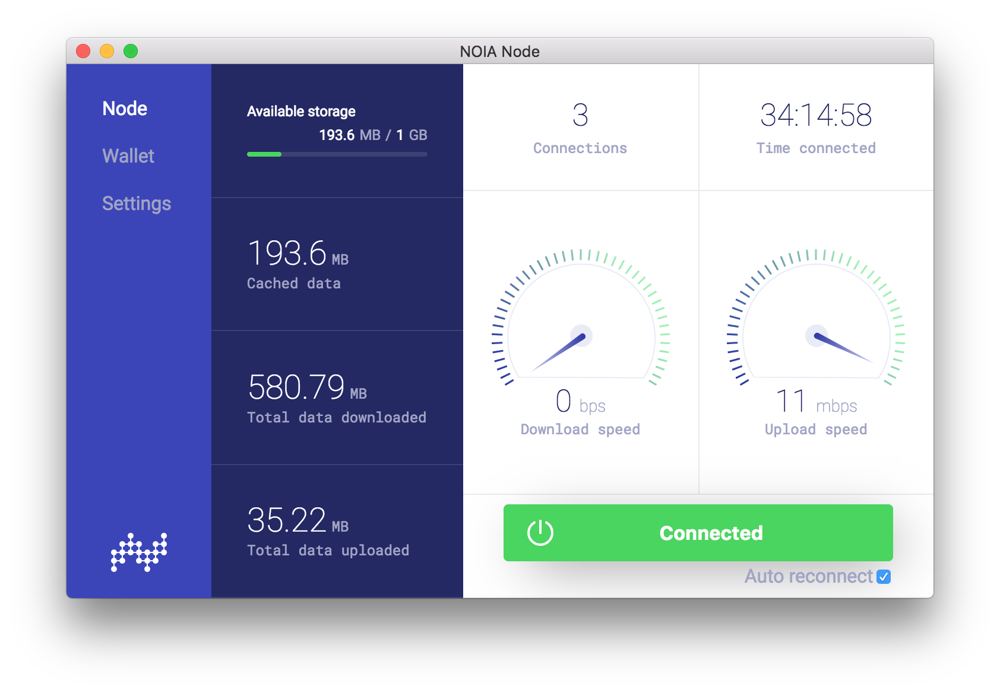

# NOIA Node GUI

This is noia-node GUI implementation for [noia-node](https://github.com/noia-network/noia-node).

## Contributing

Read contribution [guidelines here](CONTRIBUTING.md).

## License

Released under the [LGPL-2.1](LICENSE).
